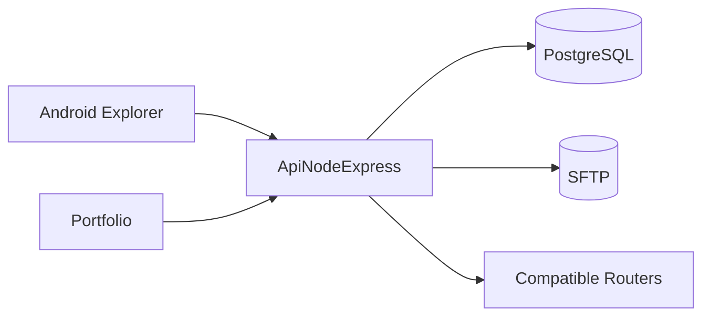
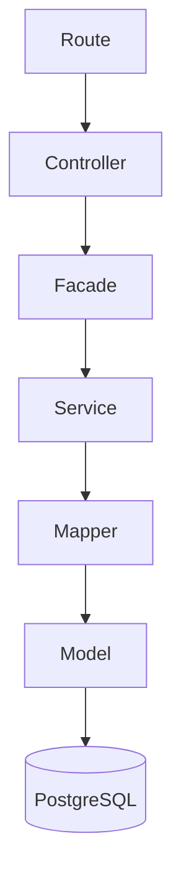

# ApiNodeExpress

[](https://nodejs.org/)

[](https://www.postgresql.org/)

[](https://pnpm.io/)
[](LICENSE)

> **A portfolio-grade REST API inspired by Spring architecture, built to manage home network resources through clean, maintainable software engineering principles.**



ApiNodeExpress is the backend foundation of a growing ecosystem designed around real-world network management rather than a simple CRUD application.


## Why this project?

ApiNodeExpress was created to solve real-world home lab problems while serving as a long-term portfolio project.

Its goal is to provide a maintainable backend capable of managing authentication, network resources, router automation and remote file access through a clean, layered architecture.

---

## Features

| Area | Description |
|------|-------------|
| Authentication | JWT authentication with refresh token rotation |
| Authorization | Role + Scope ACL |
| Users | Delegated user administration |
| Devices | Multiple connections per device |
| Router Sync | MAC whitelist synchronization |
| Storage | User-specific SFTP operations |
| Resource Sync | Incremental versions exposed through HTTP headers |
| Validation | Centralized Zod schemas |
| Error Handling | Unified ApiError pipeline |
| Testing | Vitest + executable HTTP documentation |

## Why Spring-inspired?

The project borrows Spring concepts such as layered responsibilities, explicit separation of concerns and use-case orchestration while remaining lightweight and idiomatic to Node.js.

## Architecture



> Each layer owns a single responsibility, making business rules easy to locate, test and evolve.

| Layer | Responsibility |
|---|---|
| Controller | HTTP input/output |
| Facade | Use-case orchestration, ACL and transactions |
| Service | Business rules |
| Mapper | Domain transformation |
| Model | SQL and persistence |

## Getting Started
Follow these steps to run the project locally

**Requirements**

- Node.js 24.x
- PostgreSQL 16+
- pnpm

### Installation

```bash
pnpm install
```

### Configuration

Copy `.env.example` to `.env` and configure the required secrets.

### Running

```bash
pnpm run postgres
```

### Testing

```bash
pnpm test
```

Manual API documentation is available under `tests/http`.

## Core Modules

- **Auth** — JWT authentication and refresh tokens.
- **Users** — User administration and Role + Scope ACL.
- **Devices** — Network inventory and connection management.
- **Whitelist** — Router synchronization.
- **FTP/SFTP** — Remote file management.
- **Data Versions** — Lightweight change detection for synchronized resources.

## API Usage

The .http files act as executable documentation and manual integration tests:

```text
tests/http/
```

These files serve as:

- Documentation
- Manual integration tests
- Usage examples

Collection endpoints keep their original response bodies and expose synchronization metadata through headers:

- `Data-Version` for users, devices and FTP directory listings.
- `Devices-Version` and `Whitelist-Version` for allowed and not allowed device listings.

SFTP write operations increment their resource version after a successful change, allowing clients to detect updates without downloading the complete directory listing.

Data versions can be requested together using the `id` query parameter. Supported entities are `ftp`, `devices`, `whitelist` and `users`:

```http
GET /data-versions?id=ftp,devices
```

```json
{
    "ftp": "1",
    "devices": "2"
}
```

## Key Architectural Decisions

- Split `Connection` from `Device` to support multiple interfaces.
- Introduced a dedicated `Facade` layer for use-case orchestration.
- Migrated from FTP to SFTP.
- Implemented a Role + Scope ACL model.
- Centralized validation and error handling.
- Added database-backed resource versions for lightweight client synchronization.

## Project Structure

```text
src/
    config/
    controllers/
    devices-routers/
    facades/
    mappers/
    middlewares/
    models/
    routes/
    schemas/
    services/
    utils/
    app.js
    server-postgres.js
tests/
docs/
```

## Design Principles

- Single Responsibility.
- Readability.
- Maintainability.
- Centralized validation.
- Explicit business rules.
- Simplicity over premature optimization.

## Status

🚧 **Actively developed**

This project is actively used as the backend foundation for future applications and portfolio projects.

## Roadmap

- [x] Authentication
- [x] Role & Scope ACL
- [x] Device Management
- [x] Router Synchronization
- [x] SFTP Integration
- [ ] Android Explorer
- [ ] Portfolio
- [ ] TypeScript Migration

---

*ApiNodeExpress is intended to remain a long-term project where new modules and consumers can be added without compromising the existing architecture.*


## License

This project is licensed under the MIT License. See the `LICENSE` file for details.
