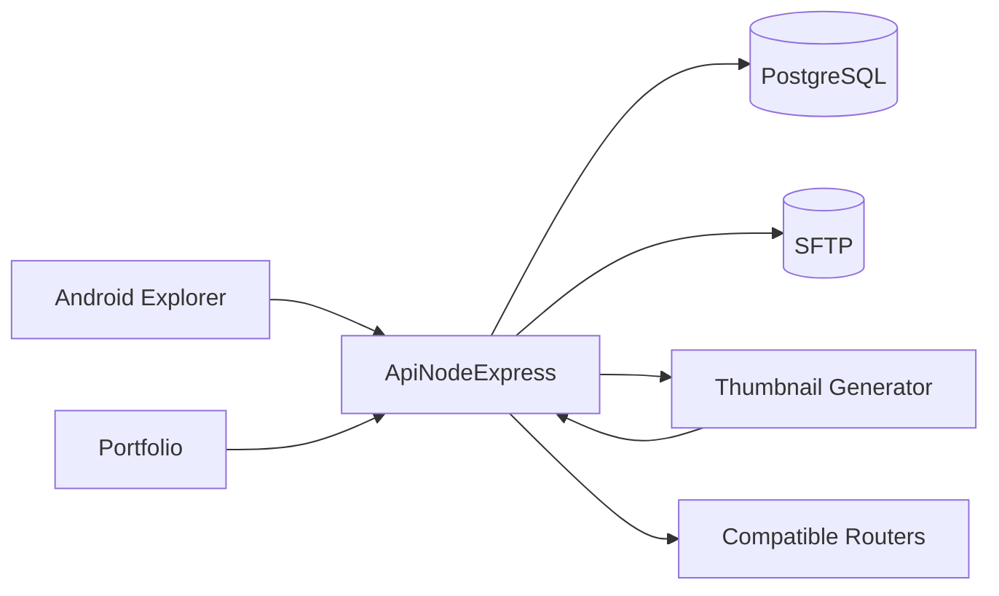
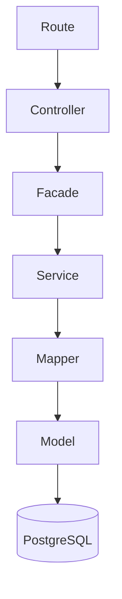

# ApiNodeExpress

[](https://nodejs.org/)

[](https://www.postgresql.org/)

[](https://pnpm.io/)
[](LICENSE)

> **A portfolio-grade REST API inspired by Spring architecture, built to manage home network resources through clean, maintainable software engineering principles.**


```mermaid
flowchart LR
    Android["Android Explorer"]
    Portfolio["Portfolio"]
    API["ApiNodeExpress"]
    DB[(PostgreSQL)]
    SFTP[(SFTP)]
    Thumbnails["Thumbnail Generator"]
    Routers["Compatible Routers"]

    Android --> API
    Portfolio --> API
    API --> DB
    API --> SFTP
    API --> Thumbnails
    Thumbnails --> API
    API --> Routers
```

ApiNodeExpress is the backend foundation of a growing ecosystem designed around real-world network management rather than a simple CRUD application.


## Why this project?

ApiNodeExpress was created to solve real-world home lab problems while serving as a long-term portfolio project.

Its goal is to provide a maintainable backend capable of managing authentication, network resources, router automation and remote file access through a clean, layered architecture.

---

## Features

| Area | Description |
|------|-------------|
| Authentication | JWT authentication with refresh token rotation |
| Authorization | Role + Scope ACL |
| Users | Delegated user administration |
| Devices | Multiple connections per device |
| Router Sync | MAC whitelist synchronization |
| Storage | Streaming SFTP operations, ZIP trees and lazy thumbnails generated in an isolated service |
| Resource Sync | Database versions and SHA-256 hashes for FTP directories |
| Validation | Centralized Zod schemas |
| Error Handling | Unified ApiError pipeline |
| Testing | Vitest + executable HTTP documentation |

## Why Spring-inspired?

The project borrows Spring concepts such as layered responsibilities, explicit separation of concerns and use-case orchestration while remaining lightweight and idiomatic to Node.js.

## Architecture


```mermaid
flowchart TD

Route[Route]
Controller[Controller]
Facade[Facade]
Service[Service]
Mapper[Mapper]
Model[Model]
DB[(PostgreSQL)]

Route --> Controller
Controller --> Facade
Facade --> Service
Service --> Mapper
Mapper --> Model
Model --> DB
```

> Each layer owns a single responsibility, making business rules easy to locate, test and evolve.

| Layer | Responsibility |
|---|---|
| Controller | HTTP input/output |
| Facade | Use-case orchestration, ACL and transactions |
| Service | Business rules |
| Mapper | Domain transformation |
| Model | SQL and persistence |

## Getting Started
Follow these steps to run the project locally

**Requirements**

- Node.js 24.x
- PostgreSQL 16+
- pnpm

### Installation

```bash
pnpm install
pnpm --dir thumbnail-generator install
```

### Configuration

Copy `.env.example` to `.env` and configure the required secrets and internal service URLs. The API and thumbnail generator communicate through `API_URL` and `THUMBNAIL_GENERATOR_URL`; the generator listens on `THUMBNAIL_GENERATOR_PORT`.

### Running

```bash
pnpm run postgres
pnpm --dir thumbnail-generator start
```

### Testing

```bash
pnpm test
pnpm --dir thumbnail-generator test
```

Manual API documentation is available under `tests/http`.

## Core Modules

- **Auth** — JWT authentication and refresh tokens.
- **Users** — User administration and Role + Scope ACL.
- **Devices** — Network inventory and connection management.
- **Whitelist** — Router synchronization.
- **FTP/SFTP** — Streaming file management, ZIP transfers and lazy thumbnails.
- **Thumbnail Generator** — Isolated FFmpeg processing over temporary range-enabled media streams.
- **Data Versions** — Database versions and per-directory FTP hashes for synchronized resources.

## API Usage

The .http files act as executable documentation and manual integration tests:

```text
tests/http/
```

These files serve as:

- Documentation
- Manual integration tests
- Usage examples

Collection endpoints keep their original response bodies and expose synchronization metadata through headers:

- `Data-Version` for users, devices and FTP directory listings.
- `Devices-Version` and `Whitelist-Version` for allowed and not allowed device listings.

FTP directory listings and write operations expose a SHA-256 directory hash through `Data-Version`. Write operations return the refreshed destination listing, allowing clients to replace their local state immediately.

Database-backed versions can be requested together using the `id` query parameter. Supported entities are `devices`, `whitelist` and `users`:

```http
GET /data-versions?id=devices,whitelist,users
```

```json
{
    "devices": "1",
    "whitelist": "2",
    "users": "3"
}
```

FTP versions are directory-specific and use a separate endpoint:

```http
GET /data-versions/ftp?dir=.
```

```json
{
    "version": "<SHA-256 directory hash>"
}
```

Uploads are parsed as multipart streams. ZIP files can be uploaded unchanged or extracted as a streamed directory tree using the `extract` query parameter. Single-file downloads stream the original resource, while multiple files and directories are generated as a streamed ZIP response.

Directory listings mark compatible media with `supportsThumbnail`. Thumbnail generation runs lazily in the background and adds each result to the bounded cache as soon as it is available. The thumbnail endpoint reports generated, pending and unavailable states with HTTP `200`, `404` and `204` respectively.

Media processing is delegated to the standalone thumbnail generator. The API exposes short-lived, range-enabled media sessions so FFmpeg can seek through SFTP files without sharing FTP credentials or buffering complete media files. Both internal endpoints restrict their accepted origin, and generated JPEG responses are limited to 5 MB.

## Key Architectural Decisions

- Split `Connection` from `Device` to support multiple interfaces.
- Introduced a dedicated `Facade` layer for use-case orchestration.
- Migrated from FTP to SFTP.
- Implemented a Role + Scope ACL model.
- Centralized validation and error handling.
- Added database-backed resource versions and per-directory FTP hashes for lightweight client synchronization.
- Streamed multipart uploads, direct downloads and ZIP trees without buffering complete files.
- Added bounded in-memory thumbnail caching with lazy background generation.
- Isolated FFmpeg in a dedicated thumbnail service with fixed protocols, demuxers, resource limits and temporary range-enabled access to SFTP media.

## Project Structure

```text
src/
    config/
        constants.js
        environment.js
        errors.js
        secrets.js
    controllers/
    devices-routers/
    facades/
    mappers/
    middlewares/
    models/
    routes/
    schemas/
    services/
    utils/
        cache/
        connection/
        error/
    app.js
    server-postgres.js
tests/
thumbnail-generator/
    src/
        config/
        controllers/
        routes/
        services/
        app.js
        server.js
    tests/
```

## Design Principles

- Single Responsibility.
- Readability.
- Maintainability.
- Centralized validation.
- Explicit business rules.
- Simplicity over premature optimization.

## Status

🚧 **Actively developed**

This project is actively used as the backend foundation for future applications and portfolio projects.

## Roadmap

- [x] Authentication
- [x] Role & Scope ACL
- [x] Device Management
- [x] Router Synchronization
- [x] SFTP Integration
- [ ] Android Explorer
- [ ] Portfolio
- [ ] TypeScript Migration

---

*ApiNodeExpress is intended to remain a long-term project where new modules and consumers can be added without compromising the existing architecture.*


## License

This project is licensed under the MIT License. See the `LICENSE` file for details.
